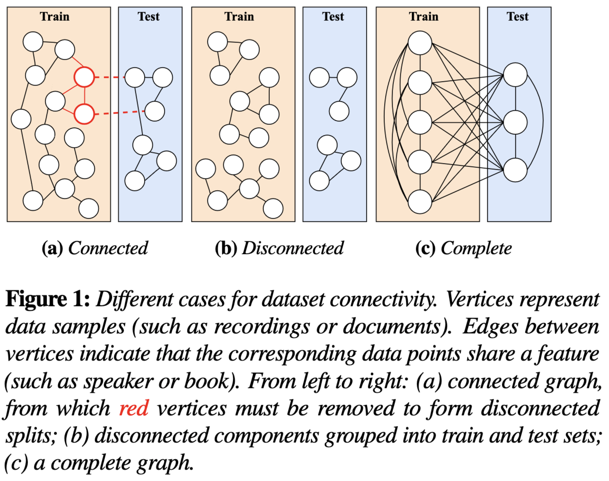
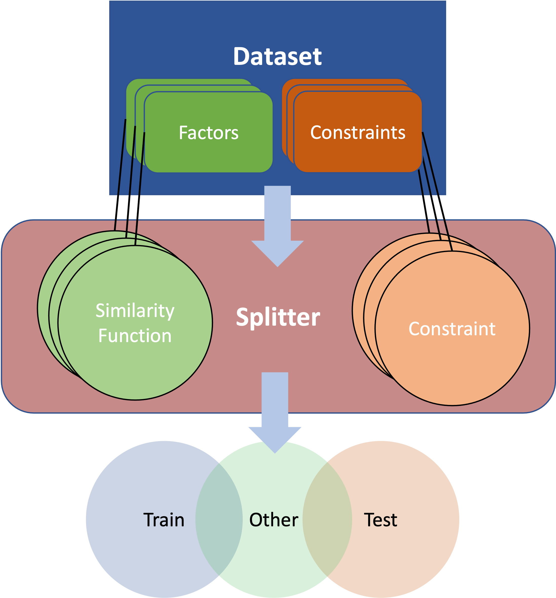

# NACHOS — Nearly Automatic Creation of Held Out Splits
nachos is a python library designed to automatically partition datasets into
splits useable for training and testing machine learning algorithms. 

## About
Machine learning algorithms rely on data for parameter estimation and model
evaluation. Typically datasets used for parameter estimation and model
evaluation are derived by splitting available data into disjoint sets — the
train and development / evaluation sets. 

The authors of this toolkit began noticing that machine learning practitioners
do not have any standard tools for creating these splits, and, with the
proliferation of end-to-end neural models that attempt to jointly model
the production of desired outputs directly from raw inputs, many released
data splits, including the commonly used splits, are not designed to test model
generalization in a meaningful way. In some community-wide speech recogntiion
challenges, the provided test/development sets were drawn from speakers **not**
seen in the training set but documents that **were** seen in the training set.

Speech recognition practitioners have repurposed the Librispeech datasplits
that were specifically designed for Hybrid ASR models, but which contain
signficant overlap of source material with examples seen in the training set,
meaning evaluation of end-to-end models trained and evaluated using these splits
may not be a meaningful comparison.

This toolkit is a python library designed to provide formal, reproducible, and
"correct" methods for splitting datasets to avoid these problems. 

## Goals
- Become the de facto method for creating data partitions for machine learning
- Formalize the assumptions made when creating data partitions so that the
  hypotheses tested when evaluating on specific splits are clear
- Interface seamlessly with other tools for data preparation, especially audio
  data preparation tools such as lhotse.
- Design stress tests of machine learning models by enabling splits containing
  only, e.g., the least similar speakers or text from those seen in training. 
- Through the use of properly created splits, potentially we will explore
  how to use such splits for causal reasoning.

## Example usage

To come ...

## Core Concepts

The core idea behind this splitting tool is to model data as a graph. Each
vertex in the graph represents a unit of data — be it a sentence, a recording,
a group of sentences uttered by a speaker speaker, or a group of utterances
consisting of the same sentence uttered by different speakers — and edges
between vertices indicate that those units of data are similar to each other.
By similar, we mean that there exists some underlying factor that relates the
two vertices. For instance two vertices might correspond to the same, or
similar speakers, the same sentence, were drawn from the same book, correspond
to the same accent, etc.. Splits are created specifically to test
generalization to new instances of these latent factors.  The task of creating
a splits then becomes to either find, or create disconnected components in the
graph. **Factors** are the properties of the data for which we wish to test
generalization.



In general, we may wish for these disconnected components to also have certain
properties: they should be close to a specified size, they should have similar
distributions of speakers, genders, or perhaps durations. We call these kinds of
properties **constraints**.

nachos defines different kinds of **splitters** which operate on datasets. They
split datasets, which are represented by a **Dataset** class, in two, creating
a training set, and a heldout set. The heldout set is special since it has been
selected specifically to be disjoint from the training set in all of the
specified **factors** and has also been chosen to at least approximately satisfy
any specified **constraints**.

A **Dataset** is simply a container for a list of data points, along with a set
of factors and constraints.

A splitter operates on the Dataset by inducing a specific graph using
**SimilarityFunctions** and **Constraints**. These are classes that group
together relationships between and constraints on each field associated with a
data point. For instance, a speaker similarity function could operate on a
speaker field associated with a data point and a set similarity function could
operate on the set of prompts that a specific speaker reads. The constraints
could be functions to ensure that the training and test partitions have matcehd
gender, and are of specific sizes.



## Installation
```
git clone https://github.com/m-wiesner/nachos.git
cd nachos 
pip install -r requirements.txt
pip install -e . 
```
## What you need to do

Create a file representing your corpus that has a column for the id of each
element of the corpus (i.e., the one you are trying to split), and then a
column for each field of metadata you have about each element in the corpus.
These metadata could be prompt, speaker ID, accent, age, health status, duration, ...

Such a file might look like the following

|id|spks|room|subj_gender|intv_gender|data_fraction|
|---|---|---|---|---|---|
|ID1|s1|r1|0|0|0.002|
|ID2|s2,s3|r1|1|0|0.00102|
|ID3|s1,s3|r2|1|0|0.005|
|ID4|s2|r2|1|1|0.02|
|ID5|s1|r3|1|0|0.00223|
|ID6|s4|r1|1|1|0.0042|
|ID7|s2,s4|r2|1|0|0.1|

This file should be a table separated (.tsv) file and represents the metadata
associated with your dataset.

## Running

Set the values in config.yaml to the desired values and then

```
python run.py metadata config
```
